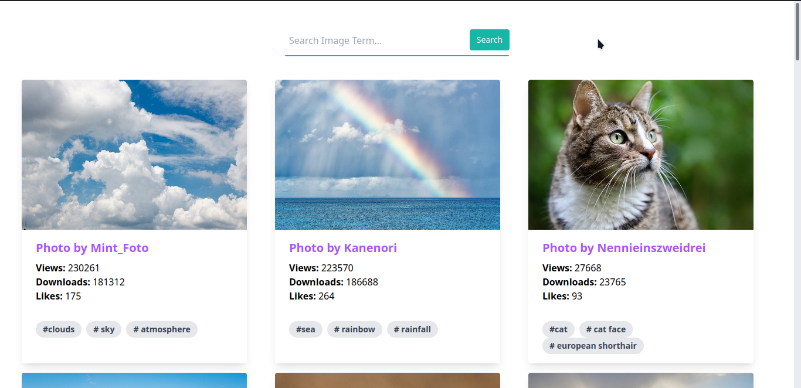

# Pixabay Image Gallery - React & Tailwind CSS

simple gallery with images from the [Pixabay](https://pixabay.com/). Tailwind CSS is built into workflow with postcss.



## Usage

Add your Pixabay API key to `.env` - Get your Pixabay API key [here](https://pixabay.com/api/docs/).

```
# Install dependencies
npm install

# Watch CSS & run server on :3000
npm start

# Build CSS and assets
npm run build
```
